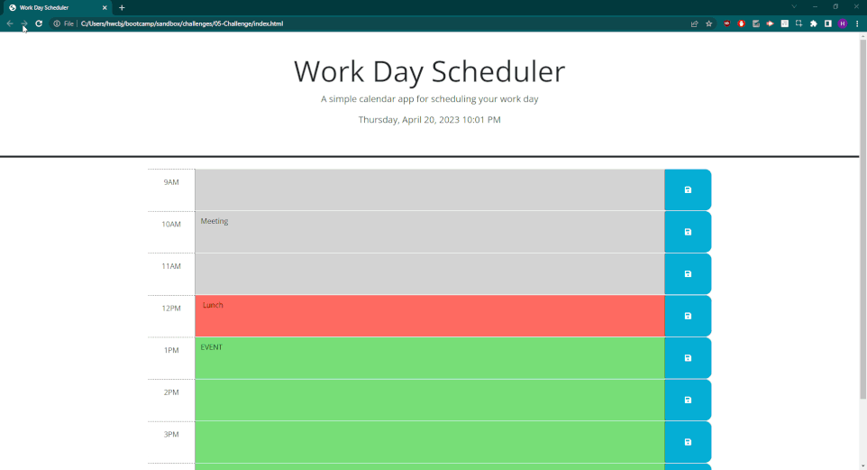

# 05 Third-Party APIs: Work Day Scheduler

## Description

This is a simple work day scheduler. It updates and displays the current day at the top of the calendar. Each timeblock is given a unique color based on the current time, such that
past time is grey, present time is orange, and future is green. After a user inputs information in the text field for a timeblock and clicks the save button, that event is stored, so
the user can refresh the page and keep it in their planner. If a user does not click save for a timeblock for input event information, then that event is not saved and disappears
upon refresh.

## Link and preview

https://hculp.github.io/work-day-scheduler/

